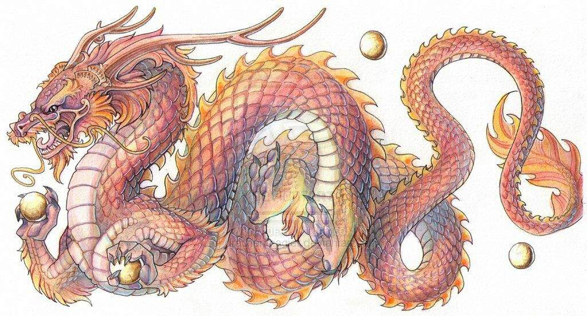
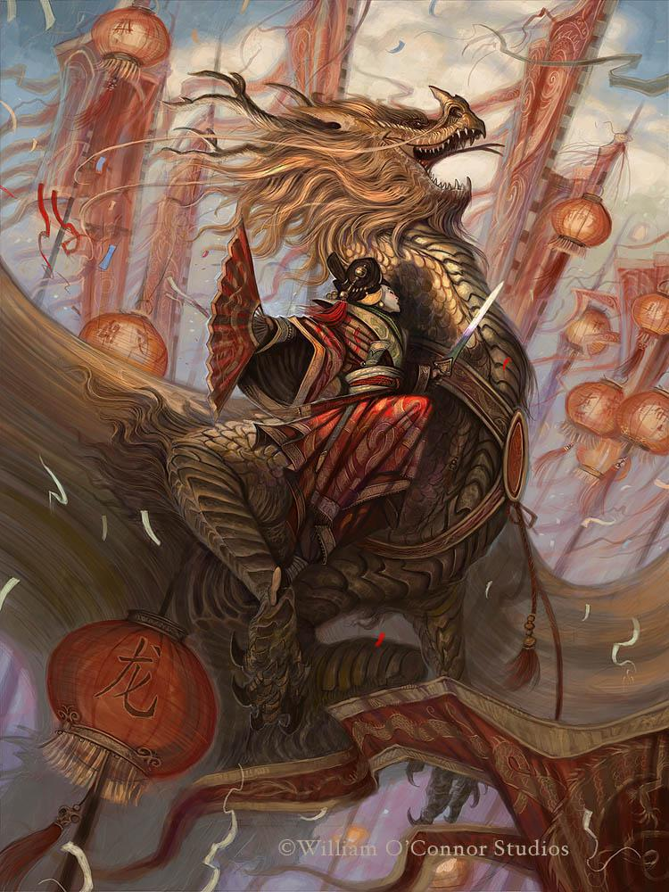
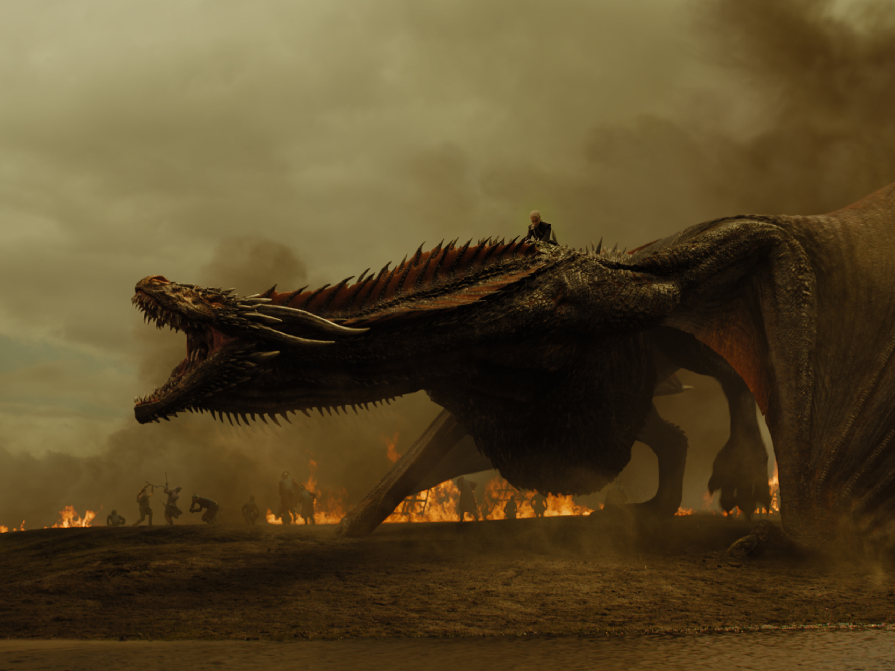

```{r setup, include=FALSE}
knitr::opts_chunk$set(echo = TRUE)
```

# Project Info

In this project, a phylogeny of dragons is made from a nexus file containing character trait codes derived from images of dragons. Character traits for 3 new dragon images are described below and their corresponding trait codes were appended to the original 'DragonMatrix' nexus file using a text editor. The phylogeny displayed at the bottom of this report includes the 3 new dragons as a group called 'NewDragon'.

All the files required for this project are in the git repository linked here:
[Github repository](https://github.com/ArjunA127/Biol432_assignment7)

# The New Dragons



Name in nexus file: ChinDrac

[drachenmagier DeviantArt](https://www.deviantart.com/drachenmagier/art/Commission-Chinese-Dragon-173199722)



Name in nexus file: ChinWill

[William O'Connor blog](http://williamoconnorstudios.blogspot.com/2011/04/legend-of-golden-dragon.html)



Name in nexus file: GameofTX

[Link to image](https://gameofthrones.fandom.com/wiki/Dragons?file=GoT-Sn7_FirstLook_18.jpg)


```{r}
# Display nice-looking table of the trait phenotypes and corresponding binary codes for the 3 new dragons

# Load Package to make an aesthetically-pleasing table
library(knitr)

# Load the trait table for the new dragons
traitTable <- read.csv("Input/Trait_table_newdragons.csv", colClasses = "character")

# Display the table
kable(traitTable,
      caption = "Table 1. Trait coding table for the new dragons.", # Table caption
      col.names = c("Dragon", "Trait Order", "Trait", "Trait Phenotype", "Binary Code"), # Column headings
      align = 'l') # Left-align the columns                                               
```

**Binary Character vectors for the new dragons:**

ChinWill: 000111110100110100110001000111011000000001100000011100??0000010000010111111100

GameOfTX: 100111110000110110000001001110101000001010000001001110??000011100000??00011100

ChinDrac: 1001????1100100100100010000111011000000001100000011100000000011000010011100???

# Load Packages

```{r message=F}
library(ape)
library(reshape2)
library(ggplot2)
library(ggtree)
```


# Import Nexus File and Trait Weights

```{r}
dragonNexus <- read.nexus.data("Input/DragonMatrix.nex")
weightDat <- read.csv("Input/Weights.csv")
```


# Apply Trait Weightings

Since some traits must be more evolutionarily conserved than others, they should be weighted more heavilly than others (e.g. the number of appendages should be highly conserved).

The weights in weightDat are on a scale from 1 through 9 and then A (A=10) through Z (Z=35). The number of digits for each trait corresponds to the number of binary values for that trait. The traits are ordered in the same order as they were encoded in the 'DragonMatrix' nexus file.

Create a single vector of weights:
```{r}
weights <- paste0(weightDat$Weight, collapse = "")
weights <- strsplit(weights,split="")[[1]]
```

Convert each weight letter to its corresponding weight value (e.g. A=10):
```{r}
# Create a vector that will contain the numeric values for the weights
weightsNum <- rep(NA, length(weights))

# Loop through weightsNum and add in weights that are already numeric and convert the weight letters to numeric values before adding them to weightsNum
for (i in 1:length(weightsNum)){
  if (weights[i] %in% LETTERS){
    weightsNum[i] <- which(LETTERS == weights[i]) + 9 # Convert letters to their corresponding weight value and put them in weightsNum
  } else{
    weightsNum[i] <- weights[i] # Add non-letter (i.e. numeric) values to weightsNum
  }
}
```

Multiply the weight value by the trait vector for each dragon:
```{r}
# This step essentially just replaces the 1s with the corresponding weight values (i.e. 1*x = x). The 0s and ?s stay the way they are (i.e. 0*x = 0, ?*x = undefined)

# Initialize an object that will be like the dragonNexus object but with the binary code replaced by the trait weights
wtDragonNexus <- dragonNexus

for (i in 1:length(dragonNexus)){
  repWeight <- dragonNexus[[i]] == 1 # For a dragon's binary character code, create a vector with boolean values, where a binary digit of 1 gives a TRUE and a binary digit of 0 gives a FALSE
  wtDragonNexus[[i]][repWeight] <- weightsNum[repWeight] # For a dragon's binary code, replace each 1 with the correponding weight value from weightsNum to generate the weighted code
  # Note that repWeight gets rewritten by the next dragon's character vector with each iteration
}

```


Calculate distance matrix:
```{r}
# Convert wtDragonNexus to a data.frame
wtDragonNexusDF <- data.frame(matrix(unlist(wtDragonNexus), ncol = 78, byrow = T))
# Add dragon names to the above data.frame
row.names(wtDragonNexusDF) <- names(wtDragonNexus)

# Calculate distance matrix
wtDragonDist<-dist(wtDragonNexusDF, method='euclidean')

# Create a 'matrix' class version of wtDragonDist
wtDragonDistMat<-as.matrix(wtDragonDist)
```

Visualize distance matrix:
```{r}
# Rearrange the data from an n×n matrix to a linear matrix
wtPDat <- melt(wtDragonDistMat)

# Display the pairwise distance matrix as a heat map
ggplot(data = wtPDat, aes(x = Var1, y = Var2, fill = value)) + 
  geom_tile() +
  scale_fill_gradientn(colours = c("white","blue","green","red")) + # Have the heat map range from white (lowest distance) to red (greatest distance)
  theme(axis.text.x = element_text(angle = 90, hjust = 1, vjust = 0.5)) # Make x-axis labels look nicer
```

# Phylogeny

Create minimal evolution (ME) tree:
```{r}
wtDragonTree <- fastme.bal(wtDragonDist)
```

## Visualize phylogeny

Parse out the classification of each taxa (e.g. country of origin, the new dragons) using regular expressions. These will be used to colour-code the phylogeny. Note that all the new dragons are grouped together as 'NewDragon', so they will share the same colour on the phylogenetic tree. This is to make them easier to find on the tree.
```{r}
# Classify the new dragons as 'NewDragon'
classif <- gsub("7[5-7].*", "NewDragon", wtDragonTree$tip.label)
# Isolate the classification for the other taxa (i.e. remove the beginning numbers and the Xs at the end)
classif <- gsub("[0-9\\.]+([^X]+)X*", "\\1", classif)
```

Group tip.labels by their corresponding classification:
```{r}
classifGroups <- split(wtDragonTree$tip.label, classif)
```

Apply the grouping information as a new attribute for plotting the tree:
```{r}
wtDragonTreeColour <- groupOTU(wtDragonTree, classifGroups)

# Notice that the new attribute "group" is now in the new phylogeny object
str(wtDragonTreeColour)
```
 
Display phylogeny:
```{r fig.width=10, fig.height=10}
# Make a ciruclar phylogeny
ggtree(wtDragonTreeColour, layout = "circular", aes(colour = group)) +
  geom_tiplab(size = 2, aes(angle = angle)) # Display tip-labels
```

It appears that the new dragons cluster independently from all the other taxa (note that this is likely inaccurate because the other taxa were coded incorrectly in the original nexus file).